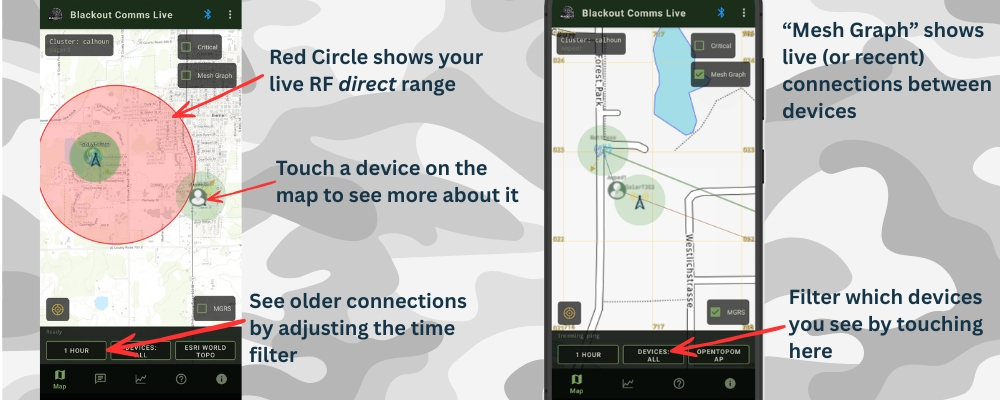

## App: Map View

This is the primary view of your Blackout Comms cluster, as seen by the device you're currently attached to (via BLE).

- Live markers for active devices (with heading arrows)
- **Range indicators** around devices in direct RF range of the connected communicator
- **Mesh Graph** overlay showing link quality
- Offline devices persist thanks to firmware Mesh Memory
- Broadcast and direct messages popup on the screen as you receive them

**Interaction**: The app receives real-time updates from the connected device, which itself gets data via the firmware mesh.