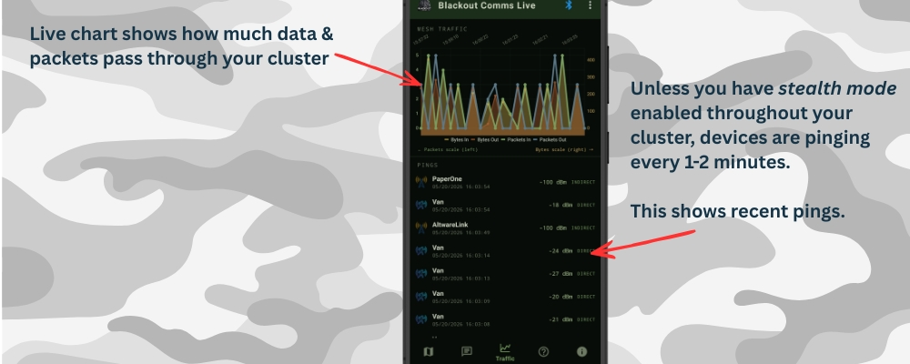

## App: Traffic View

Technical diagnostics:
- Packets & bytes chart
- Ping log (RSSI + DIRECT / INDIRECT)

**DIRECT** pings = within RF range of the connected device (firmware neighbor data).

Use this view to check signal strength of nearby devices and to optimize node placement.