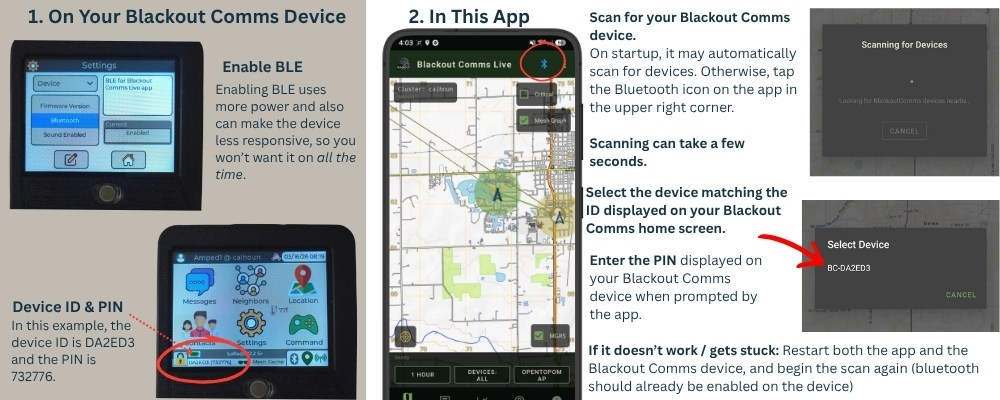

## Connecting the App to a Device

**1. On the Blackout Comms Device (Firmware)**
- Power on your communicator (T-Deck, Heltec, etc.).
- Make sure **Bluetooth is enabled** on the device (most devices show a Bluetooth icon or menu option when powered on).
- Note your **Device ID and PIN** — these are usually displayed on the device's screen during startup or in the settings menu.

**2. In Blackout Comms Live (App)**
1. Open the app.
2. Tap the **Bluetooth icon** in the top toolbar.
3. The app will scan for nearby Blackout Comms devices.
4. Select your device from the list.
5. Enter the **PIN** shown on the device screen.
6. The app will connect via BLE and begin receiving live cluster data.

**Important Notes**
- The app **remembers** the last successfully connected device. Next time you open the app it will try to reconnect automatically.
- To connect to a different device, use the Bluetooth menu and choose **"Forget BLE Device"**.

**Troubleshooting Connection Issues**
If you have trouble connecting:
1. Restart **both** the Blackout Comms device and the BCL app.
2. In the app, go to Bluetooth menu → **Forget BLE Device**.
3. Repeat the one-time pairing process above.

This resolves most Bluetooth pairing glitches.