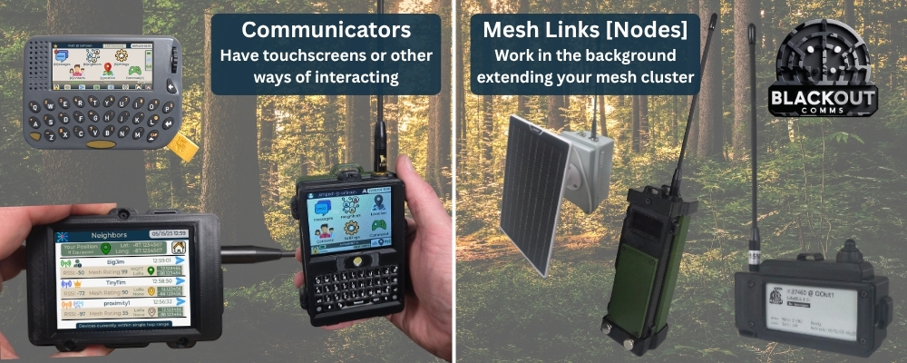
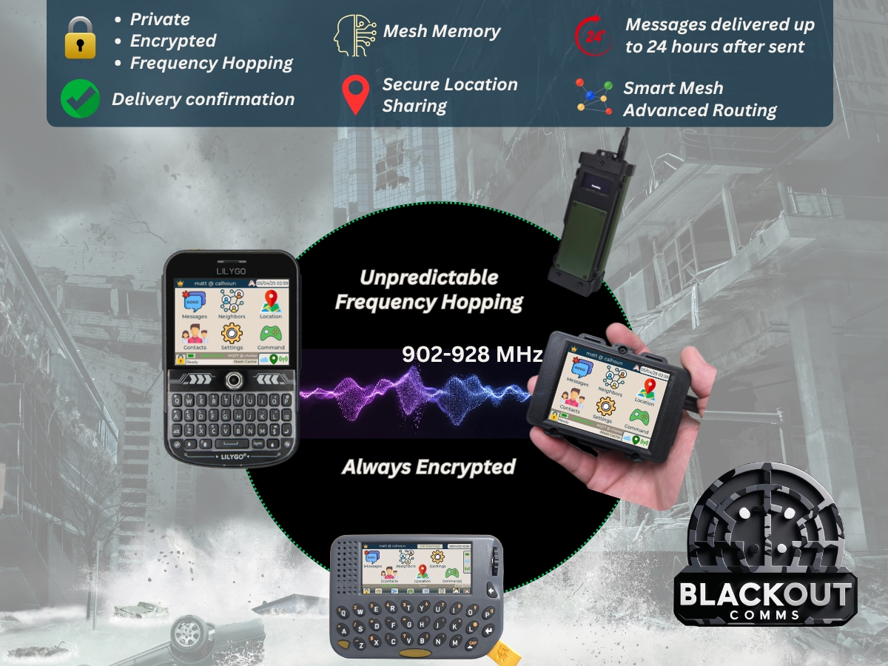
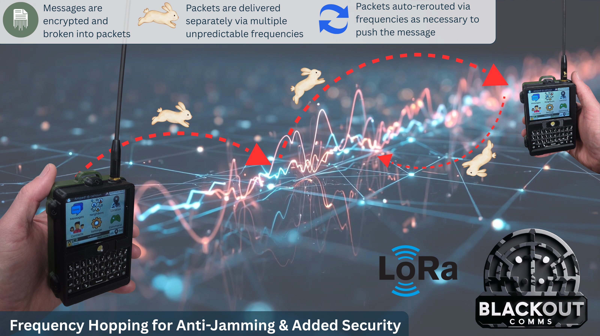

## Firmware Basics

Blackout Comms is a mesh system that is, at its core, a firmware-based secure mesh network running on a set of two or more LoRa-enabled devices, designed for off-grid use.

Mesh devices are classified as either a **communicator** or a **mesh link**. Communicators have touchscreens and/or keyboards. Mesh Links can be used as base stations or carried around. Both device types function as repeaters and trackers.

All Blackout Comms devices running in a private cluster support:
- Encrypted messaging & location sharing
- Frequency hopping for anti-jamming
- Private clusters (only onboarded devices can participate)
- Mesh Memory (see dedicated section)
- Per-message ECDSA signing

The firmware is what actually moves data through the air. The app connects to one device via BLE and receives a feed of the entire cluster state through it.