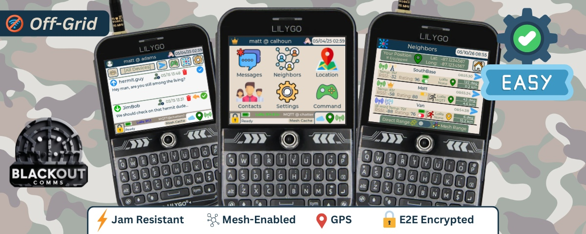

## Getting Started

Once you have devices, you can get your own private cluster up and running easily in minutes.

Learn & watch demos of how to set up your own private Blackout Comms cluster at: https://chatters.io

**Firmware Side**
1. Flash supported hardware
2. Create cluster on root device
3. License the root

**App Side** (optional)
1. Install Blackout Comms Live
2. Connect via Bluetooth to any cluster device

The app immediately receives the full cluster picture via the firmware running on the connected device.