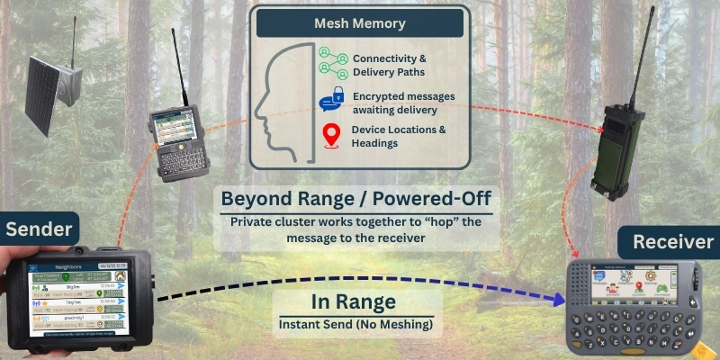

## Mesh Memory

This is one of the most powerful capabilities of Blackout Comms firmware.

Every active node retains and propagates the last known state of **every** cluster member — even devices that are powered off.

**What is remembered**:
- Last GPS position, heading, speed
- Battery level
- RF connectivity data
- Trust certificates
- Broadcast message history

**How the app uses it**:
- Offline devices remain visible on the map at their last known location.
- Tap an offline marker in the app to see its last known vitals and timestamp.

This is why a newly powered-on device immediately has full situational awareness.