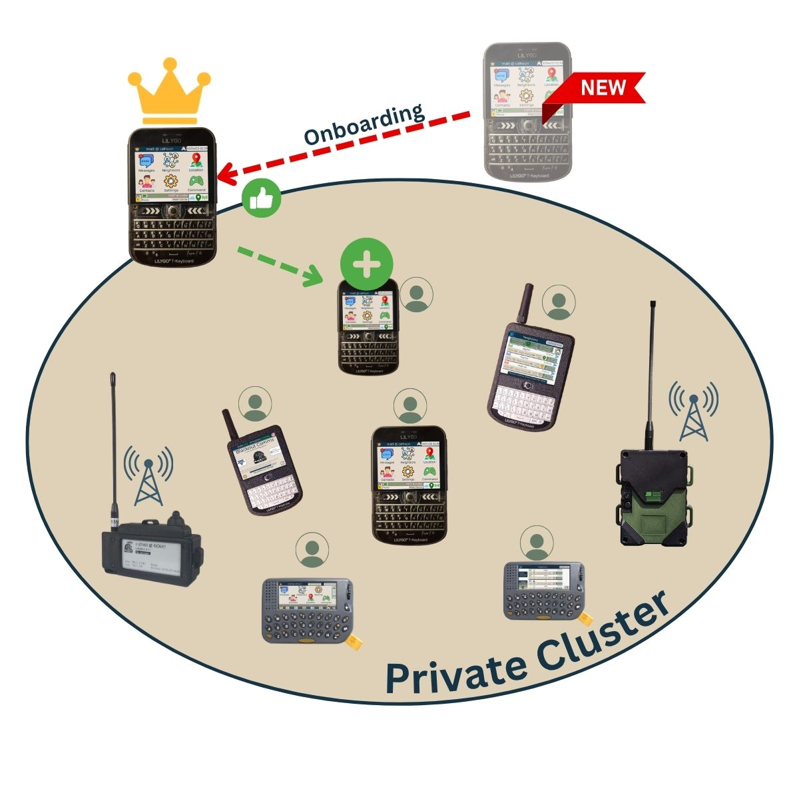

# Onboarding Devices

Onboarding is the process of adding a new device to your private cluster. Only the root device can onboard.

Once a new device is onboarded, all existing devices in your cluster will quickly learn about the new device and trust it automatically.

**Firmware Process** (directly on devices, not in the app)
- Root Device: Choose Settings / Cluster / Onboard Device
- Bring new device within range
- New Device: Choose Settings / Cluster / Join Cluster
- Root automatically provides cluster info and gives the new device proof it belongs to the cluster
- Both devices reboot and the new device joins the mesh, other devices learn to trust it, now that it has proof it belongs to the cluster
