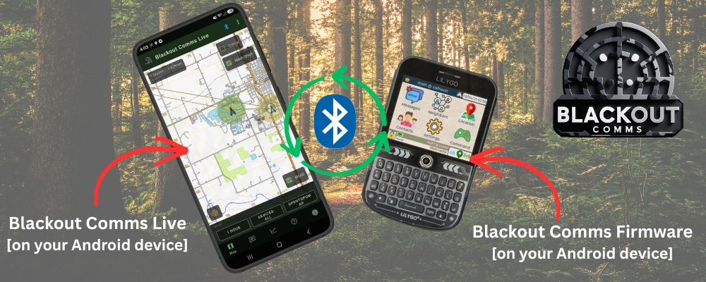

## Blackout Comms Overview

**Blackout Comms Firmware** runs on your LoRa hardware devices and creates a private, encrypted, off-grid mesh network.

**Blackout Comms Live (this app)** is the companion Android app that connects via Bluetooth to any device in the cluster and gives you a live command-and-intelligence view of the entire network.

The firmware handles all mesh communication, encryption, and memory. The app is a monitoring and visualization tool — it does not send messages itself but shows everything the mesh knows.