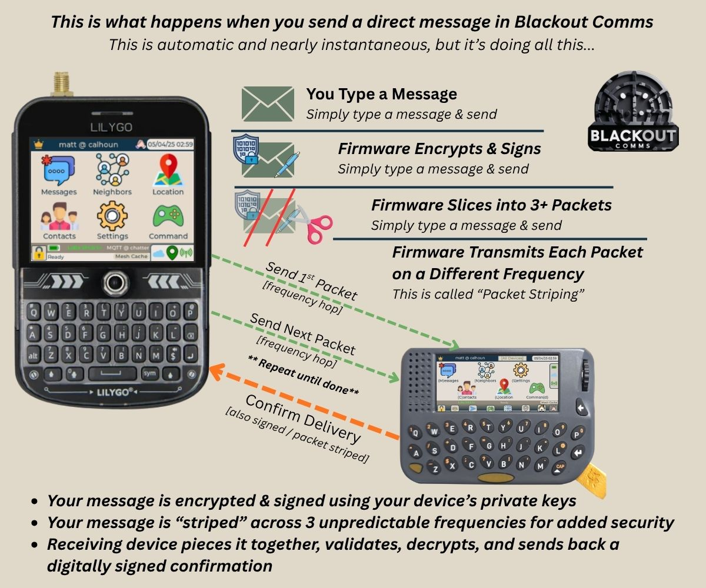
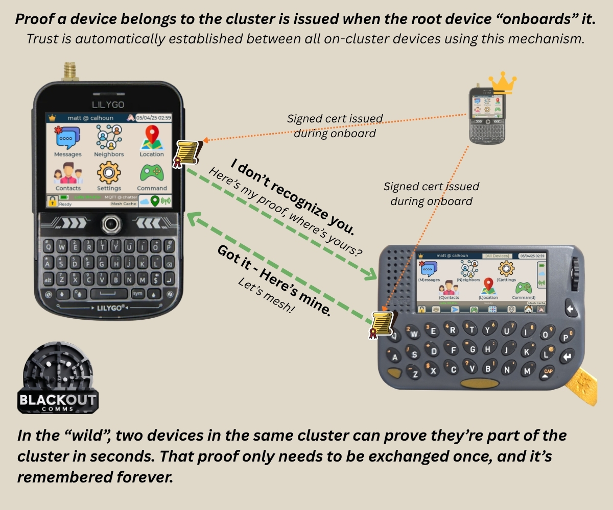

## Trust & Security

**Message Security**
- Direct messages are asymmetrically encrypted using unique sender/recipient keypairs which never leave the devices
- Broadcast messages are symmetrically encrypted using a set of keys known only to the cluster
- ECDSA Message Signing: Every message is signed with the sender’s private key. The app can display verified messages with confidence.
- Frequency Hopping: Messages are split into packets and striped across multiple frequencies
- Private Clusters: Only devices onboarded by the root can join. Strong isolation from outsiders.

**Zero-Touch Trust**

The root device issues signed certificates. Devices automatically verify trust when they meet — no manual pairing required. Certificates propagate via Mesh Memory.

The app displays trust status indirectly through connectivity and message verification.